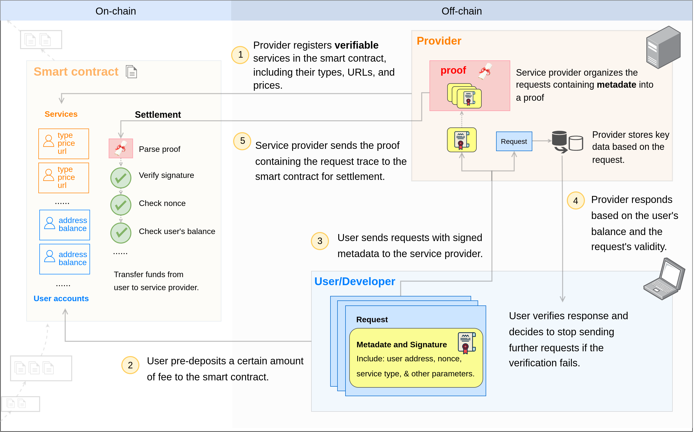

# 0G Compute Network

Access affordable GPU computing power for AI workloads through a decentralized marketplace.

## AI Computing Costs Are Crushing Innovation

Running AI models today means choosing between:
- **Cloud Providers**: $5,000-50,000/month for dedicated GPUs
- **API Services**: $0.03+ per request, adding up to thousands monthly
- **Building Infrastructure**: Millions in hardware investment

**Result**: Only well-funded companies can afford AI at scale.

## Decentralized GPU Marketplace

0G Compute Network connects idle GPU owners with AI developers, creating a marketplace that's:
- **90% Cheaper**: Pay only for compute used, no monthly minimums
- **Instantly Available**: Access 1000s of GPUs globally
- **Verifiable**: Cryptographic proofs ensure computation integrity

Think of it as "Uber for GPUs" - matching supply with demand efficiently.

## Architecture Overview

The network consists of:
1. **Smart Contracts**: Handle payments and verification
2. **Provider Network**: GPU owners running compute services
3. **Client SDKs**: Easy integration for developers
4. **Verification Layer**: Ensures computation integrity

## Key Components

### 🤖 Supported Services

| Service Type | What It Does | Status |
|--------------|--------------|--------|
| **Inference** | Run pre-trained models (LLMs) | ✅ Live |
| **Fine-tuning** | Fine-tune models with your data | ✅ Live |
| **Training** | Train models from scratch | 🔜 Coming |

### 🔐 Trust & Verification

**Verifiable Computation**: Proof that work was done correctly
- TEE (Trusted Execution Environment) for secure processing
- Cryptographic signatures on all results
- Can't fake or manipulate outputs

<b>What makes it trustworthy?</b>

**Smart Contract Escrow**: Funds held until service delivered
- Like eBay's payment protection
- Automatic settlement on completion
- No payment disputes

## Quick Start Paths

### 👨‍💻 "I want to use AI services"

Two integration paths — pick one:

**[Compute Router](./router/overview)** *(recommended for most apps)* — a single OpenAI-compatible endpoint with one unified balance, automatic provider failover, and an API key. Ideal for server-side apps, agents, and prototypes.
1. Get an API key at [pc.0g.ai](https://pc.0g.ai)
2. Deposit 0G tokens
3. Point your OpenAI SDK at `https://router-api.0g.ai/v1`

**[Direct](./direct)** — connect to individual providers via the `@0gfoundation/0g-compute-ts-sdk` SDK, manage per-provider sub-accounts, sign requests with your wallet. Use this for browser dApps with wallet signing, on-chain control, or when you need **fine-tuning** (Router is inference-only).
1. [Install SDK](./inference) and pick a provider
2. [Fund your account](./account-management) — shared across inference and fine-tuning
3. Run [Inference](./inference) or [Fine-tuning](./fine-tuning)

Deeper comparison: [Router vs Direct](./router/comparison).

### 🖥️ "I have GPUs to monetize"
Turn idle hardware into revenue:
1. Check [hardware requirements](./inference-provider#prerequisites)
2. [Set up provider software](./inference-provider#launch-provider-broker)

### 🎯 "I need to fine-tune AI models"
Fine-tune models with your data:
1. [Install CLI tools](./fine-tuning#install-cli)
2. [Prepare your dataset](./fine-tuning#prepare-your-data)
3. [Start fine-tuning](./fine-tuning#create-task)

## Frequently Asked Questions

<b>How much can I save compared to OpenAI?</b>

Typically 90%+ savings:
- OpenAI GPT-4: ~$0.03 per 1K tokens
- 0G Compute: ~$0.003 per 1K tokens
- Bulk usage: Even greater discounts

<b>Is my data secure?</b>

- Every provider runs inside a TEE (Trusted Execution Environment) that isolates the serving process from external access to your inference traffic.
- Provider responses are cryptographically signed by the TEE's private key, so you can verify the exact model that ran.
- The Router stores only billing metadata (token counts, model, provider, timestamp) — not request or response bodies.

<b>How fast is it compared to centralized services?</b>

Observed latency varies by model, provider load, and your distance to the provider. For chatbot workloads it is typically in the same range as centralized API services; check the provider list at [pc.0g.ai](https://pc.0g.ai) for live health and latency data per provider.

---

*0G Compute Network: Democratizing AI computing for everyone.*